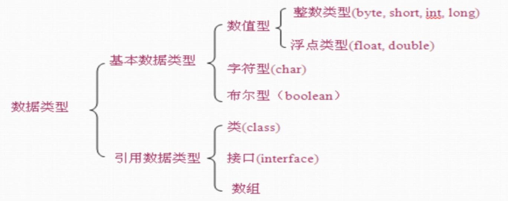
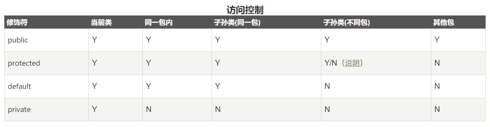

# Java 基础

## 1.Java 环境介绍

### 1.名词解释

- **Java SE(Java Standard Edition)**: 标准版本, 是 Java 的基础,包含 Java 语言基础,JDBC(Java 数据库连接), I/O,网络通信,多线程等技术;
- **Java EE(Java Enterprise Edition)**: 企业版本,主要用于企业级的网络程序;核心为 EJB(企业 Java 组件模型);
- **Java ME(Java Micro Edition)**: 在移动设备和嵌入式设备上运行;
- **JVM(Java Virtual Machine)**: Java 虚拟机;
- **JDK(Java SE Development Kit)**:可以认为就是 Java SE,
- **OpenJDK**:JDK 的一个分支, 开源版本;
- **JRE(Java Runtime Environment JDK)**: Java 运行时环境,包含 Java 虚拟机,Java 基础类库.
- **javac**: Java 的编译器, 用于把 java 源码文件编译为 java 字节码文件;
- **jar**: 用于把一组`.class`文件打包成一个`.jar`文件,方便发布;
- **jdb**: Java 调试器;

### 2.环境变量

- `JAVA_HOME`: 指定 JDK 安装路径;
- `CLASSPATH`: JVM使用的环境变量, 指示如何搜索`class`;
  - 安全的做法是在启动JVM的时候设置: `java -cp .:xxx:`
  - 启动jvm时如果未指定`classpath`, 则默认是当前目录;
  - 无需将Java核心库添加到`classpath`中！JVM根本不依赖`classpath`加载核心库！

### 3.语言风格

- 变量,方法名: 首字母小写和驼峰法命名;
- 常量: 所有字母大写, 下划线连接;
- 类名: 首字母大写和驼峰原则;

## 2.基本概念

### 1.数据类型

- 常量: 关键字`final`修饰;
- 变量: 应采用驼峰命名规则;
- 数据类型:

  - **基本数据类型**: 变量存储的时数据本身;
  - **引用数据类型**: 变量保存的数据空间地址;
  - `char`: 2 个字节, 保存 Unicode 编码, 使用单引号;

  

### 2.数组

- 声明:`数据类型[] 数组名`或者 `数据类型 数组名[]`; 例如: `int[] a; char a[]`;
- 分配空间: `int[] a = new int[5];`, 创建长度为 5 的数组, 所有元素值默认为`0`;
- 直接赋值: `int[] b = {1,2,3};` 等价于 `int[] b = new int[]{1,2,3};`
  - **不可以同时指定长度和指定初始化**

### 3.包

> java中定义了一种命名空间, 称为包`package`, 一个完整的类名`包名.类名`;
>

- 使用`package`声明类所在的包;
- 使用`import`导入包内的类;

### 4.特殊语法

- `&, &&,`都是或操作, `|, ||`都是与操作, 区别在于:
  - `&, |`: 会对所有条件执行计算;
  - `&&, ||`: 短路运算符, 如果第一个表达式已经决定结果则不计算第二个表达式;
- 条件运算符: `布尔表达式? 表达式1:表达式2`
- `for( i: arr){ ... }`: 遍历`arr`, 获取每个元素 存放到`i`中;
- `==`: 用于对象, 比较地址是否相同; 对象如果需要比较值, 需要使用`.equals()`方法;

## 3.类和接口

> 对象的创建: `类名 对象名 = new 类名(参数);`
>
> 一个 java 文件中可以定义多个类, 但最多只有一个类被`public`修饰, 并且这个类名与文件名必须相同;
>
> 类名的命名规则: **首字母大写, 驼峰命名规则;**

### 1.修饰符

#### 1.方法和属性的修饰符

- **访问权限控制**

  - `default` (即缺省，什么也不写）: 在同一包内可见。使用对象：类、接口、变量、方法;

  - `public` : 对所有类可见。使用对象：类、接口、变量、方法;

  - `protected` : 对同一包内的类和所有子类可见。使用对象：变量、方法。 **注意：不能修饰类（外部类）**;

  - `private` : 在同一类内可见。使用对象：变量、方法。 **注意：不能修饰类（外部类）**;

    
- **非访问修饰符**
  - `static`: 静态变量或静态方法;
  - `final`: 常量, 或不可被子类重写的方法;
  - `abstract`: 抽象方法;
  - `synchronized`: 修饰方法, 同一时间只能被一个线程访问;
  - `volatile`: 修饰属性, 强制从内存中获取值;

#### 2.类或接口的修饰符

- `public`: 公共类, 可以被任何对象访问;
- `abstract`: 抽象类;
- `final`: 最终类, 不能被其他类继承;
- `friendly`: 默认, 相同包中的对象才可以使用;

### 2.方法和属性

- `this`: 在方法内使用, 代码对象本身;
- 可变参数列表`void sum(int...n)`, 可以接收若干个参数, `n`作为数组使用;

  - 可以传入多个参数, 也可以传入数组;
  - 可变参数必须放在参数末尾;
  - 方法重载时, 优先调用不含有可变参数的方法;

- 构造方法:

  - 方法名与类名相同且无返回值(`void`省略)的方法;
  - 当没有提供构造方法时, 系统会默认生成一个无参的默认构造方法(所以`new`的时候不传参), 但是当用户定义了构造方法后, 就不会自动生成默认构造方法(所以`new`的时候必须根据构造方法进行传参), 可以定义多个构造方法, 相互之间是重载方法;

- 方法重载
  - 同一类中, 方法名相同, 但参数不同的方法;

- 静态属性和方法
  - 空间在所有的实例间共享;
  - 推荐使用类名访问静态字段;

### 3.继承

- Java 是单继承, 一个类有且仅有一个父类, 只有`Object`没有父类;
- `Object`类: 所有类都源自`Object`类;

  - `Object`提供了`toString(), equals()`等方法, 可以根据需要进行重写;
  - `equals()`: 对象的比较;
  - `clone()`: 创建并返回一个对象拷贝;
  - `toString()`: 返回一个对象的字符串表示;

- 继承的语法: `class ChildrenClass extends FatherClass{}`

- `super`关键字: 在子类中访问父类的方法和属性(子类可见的也可以直接访问);
  - `super`就代表父类的存储空间表示(或者说父类的引用)
  - 当需要在子类构造函数中显式调用父类的构造方法时: 需要放在子类构造方法的最前面调用`super(x,x,x)`;
- `instanceof`运算符: 判断对象是否为某个类的实例 `dog instanceof Animal`;
- 重写方法:
  - 重写函数的访问修饰符权限只能大于等于父类方法的访问权限;
- `@Override`: 注解方法, 标识该方法为重写方法;

### 4.抽象类

> 含有抽象方法的类

- 抽象方法:
  - 父类本身不需要实现, 仅作为标识, 仅仅定义方法, 需要子类实现;
  - 方法用`abstract`修饰, `abstract void func(){}`;
  - 存在抽象方法时, 类也必须使用`abstract`修饰;
- 抽象类只能被继承, **不能被实例化**;
- 继承抽象的类的子类如果也没有定义该函数,则也会成为抽象类, 只能被继承;

### 5.接口

> 接口并不是类, 而是另外一种引用数据类型, (引用类型包括: 数组, 接口, 类);
>
> 用`interface`关键字修饰: `interface Person{}`;

- 一个类只能继承一个父类, 但是可以实现多个接口;

```java
class ClassName implements Interface1, Interface2{
    ...
}
```

- 接口也可以继承另一个或多个接口;
- 成员都为常量或抽象方法;
- 接口中的所有方法都是使用`public abstract`修饰, 可是省略;
- 接口中的所有属性都是使用`public static final`修饰, 可以省略;
- 接口实现: 类通过`implements 接口1,接口2`来实现一个或多个接口;

### 6.其他

- 构造代码块, 静态构造代码块`{}`:

  - 如果放在方法中, 为普通代码块, 定义的变量为块作用域;
  - 放在类中, 为构造代码块, 实例化对象的时候调用;
  - `static`修饰的构造代码块: 只在类加载的时候执行一次, 仅可对静态成员赋值;

  ```java
  class ClassName{
      {
          // 构造代码块;
      }
  }
  ```

- `static`: 关键字

  - 静态成员:
    - 属于类所有, 值被所有成员共享, 推荐使用类名访问`ClassName.xxx`;
    - 类第一次加载就会产生;
    - 可以使用静态初始化块进行初始化;
  - 静态方法:
    - 可以直接调用静态属性或静态方法, 但不能调用非静态属性或方法(因为没有绑定`this`);

- `final`: 关键字:

  - 修饰类: 该类不能被继承;
  - 修饰变量: 常量声明, 该变量不可改变. 如果是引用类型, 不能修改引用, 属性则不受限制;
  - 修饰方法: 该方法不能被重写;

- **内部类**: （ Inner Class ）就是在一个类里面定义的类。与之对应，包含内部类的类被称为外部类。
- 内部类提供了更好的封装，可以把内部类隐藏在外部类之内，不允许同一个包中的其他类访问该类
  - 内部类的方法可以直接访问外部类的所有数据，包括私有的数据
  - 内部类所实现的功能使用外部类同样可以实现，只是有时使用内部类更方便
- 内部类可以分为: `成员内部类,静态内部类, 方法内部类, 匿名内部类`
- **匿名内部类**: 内部类的简化写法
- 包: 类文件的管理

  - 包声明: `package pkg1[.pkg2]`, 包声明放在类文件的第一行，每个类文件只能有一个包声明;
  - 包导入: `import pkg1.pkg2.ClassName`
  - 包名习惯命名为`域名倒序+模块+功能`, 应该小写;

## 4. 特殊类

### 1.Object

### 2.包装类

- 为了是操作更有效率, 给每一种基本类型提供了包装类;
- 装箱, 拆箱
  - 装箱: 从基本类型转换为对应的包装类型对象, `Integer i = 100;`
  - 拆箱: 从包装类对象转换为对应的基本类型; `int index = i`;
- 自动装箱: 可以使用`Integer i = 100`直接创建包装类对象, 而不使用`new`;


### 3.集合

## 5.通用问题

### 1.单例

> 类只有一个实例
>
> 实现: 1.只提供私有的构造方法, 2.静态的私有对象, 3.提供一个静态的共有的方法;

- 饿汉: 在属性定义时就调用构造方法进行实例化`private static SingletonClass instance = new SingletonClass()`
  - 线程安全;
- 懒汉: 在首次调用获取实例的方法时实例对象;
  - 存在线程风险, 需要线程间同步;

## 6.存档和部署

### 1.JDK 中的主要包

### 2.JAR 包

> [参考](https://www.ibm.com/developerworks/cn/java/j-jar/index.html)
>
> Java Archive File: Java 档案文件, 兼容 zip 的一种压缩格式;

- JAR 文件可以用于:
  - 用于发布和使用类库
  - 作为应用程序和扩展的构建单元
  - 作为组件、applet 或者插件程序的部署单位
  - 用于打包与组件相关联的辅助资源
- 打包相关文件:

  - `MANIFEST.MF`: 定义了与扩展和包相关的数据
  - `INDEX.LIST`: 这个文件由 `jar`工具的新选项 `-i`生成，它包含在应用程序或者扩展中定义的包的位置信息。它是 JarIndex 实现的一部分，并由类装载器用于加速类装载过程。
  - `xxx.SF`: 这是 JAR 文件的签名文件。占位符 *xxx*标识了签名者。
  - `xxx.DSA`: 与签名文件相关联的签名程序块文件，它存储了用于签名 JAR 文件的公共签名。

- `jar`命令使用:

### 3.注解

## UML
