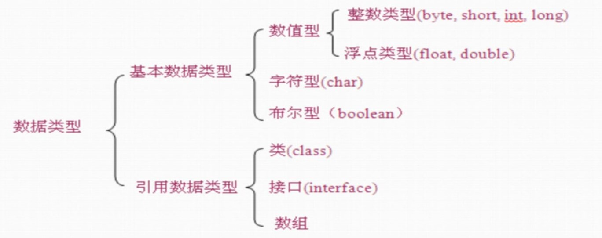

# Java 基础

## 1.Java 环境介绍

### 1.名词解释

- **Java SE(Java Standard Edition)**: 标准版本, 是 Java 的基础,包含 Java 语言基础,JDBC(Java 数据库连接), I/O,网络通信,多线程等技术;
- **Java EE(Java Enterprise Edition)**: 企业版本,主要用于企业级的网络程序;核心为 EJB(企业 Java 组件模型);
- **Java ME(Java Micro Edition)**: 在移动设备和嵌入式设备上运行;
- **JVM(Java Virtual Machine)**: Java 虚拟机;
- **JDK(Java SE Development Kit)**:可以认为就是 Java SE,
- **OpenJDK**:JDK 的一个分支, 开源版本;
- **JRE(Java Runtime Environment JDK)**: Java 运行时环境,包含 Java 虚拟机,Java 基础类库.
- **javac**: Java 的编译器, 用于把 java 源码文件编译为 java 字节码文件;
- **jar**: 用于把一组`.class`文件打包成一个`.jar`文件,方便发布;
- **jdb**: Java 调试器;

### 2.环境变量

- `JAVA_HOME`: 指定 JDK 安装路径;
- `CLASSPATH`: JVM使用的环境变量, 指示如何搜索`class`;
  - 安全的做法是在启动JVM的时候设置: `java -cp .:xxx:`
  - 启动jvm时如果未指定`classpath`, 则默认是当前目录;
  - 无需将Java核心库添加到`classpath`中！JVM根本不依赖`classpath`加载核心库！

### 3.语言风格

- 变量,方法名: 首字母小写和驼峰法命名;
- 常量: 所有字母大写, 下划线连接;
- 类名: 首字母大写和驼峰原则;

## 2.基本概念

### 1.数据类型

- 常量: 关键字`final`修饰;
- 变量: 应采用驼峰命名规则;
- 数据类型:

  - **基本数据类型**: 变量存储的时数据本身;
  - **引用数据类型**: 变量保存的数据空间地址;
  - `char`: 2 个字节, 保存 Unicode 编码, 使用单引号;

  

### 2.数组

- 声明:`数据类型[] 数组名`或者 `数据类型 数组名[]`; 例如: `int[] a; char a[]`;
- 分配空间: `int[] a = new int[5];`, 创建长度为 5 的数组, 所有元素值默认为`0`;
- 直接赋值: `int[] b = {1,2,3};` 等价于 `int[] b = new int[]{1,2,3};`
  - **不可以同时指定长度和指定初始化**

### 3.特殊语法

- `&, &&,`都是或操作, `|, ||`都是与操作, 区别在于:
  - `&, |`: 会对所有条件执行计算;
  - `&&, ||`: 短路运算符, 如果第一个表达式已经决定结果则不计算第二个表达式;
- 条件运算符: `布尔表达式? 表达式1:表达式2`
- `for( i: arr){ ... }`: 遍历`arr`, 获取每个元素 存放到`i`中;
- `==`: 用于对象, 比较地址是否相同; 对象如果需要比较值, 需要使用`.equals()`方法;
