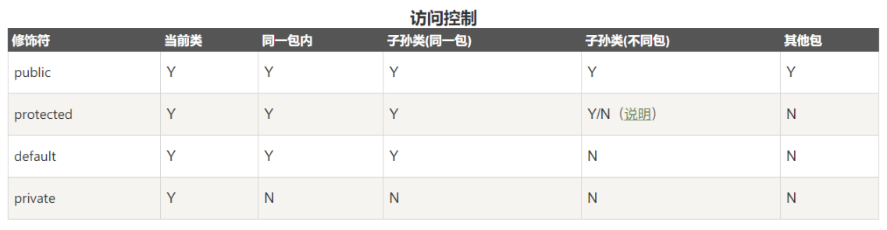

# Java面向对象

> 对象的创建: `类名 对象名 = new 类名([参数]);`
>
> 一个 java 文件中可以定义多个类, 但最多只有一个类被`public`修饰, 并且这个类名与文件名必须相同;
>
> 类名的命名规则: **首字母大写, 驼峰命名规则;**

## 1.修饰符

### 1.1 方法和属性的修饰符

- **访问权限控制**

  - `default` (即缺省，什么也不写）: 在同一包内可见。使用对象：类、接口、变量、方法;

  - `public` : 对所有类可见。使用对象：类、接口、变量、方法;

  - `protected` : 对同一包内的类和所有子类可见。使用对象：变量、方法。 **注意：不能修饰类（外部类）**;

  - `private` : 在同一类内可见。使用对象：变量、方法。 **注意：不能修饰类（外部类）**;

    
- **非访问修饰符**
  - `static`: 静态变量或静态方法, *父类的静态方法, 子类是无法重写的*;
  - `final`: 常量, 或不可被子类重写的方法;
  - `abstract`: 抽象方法;
  - `synchronized`: 修饰方法, 同一时间只能被一个线程访问;
  - `volatile`: 修饰属性, 强制从内存中获取值;

### 1.2 类或接口的修饰符

- `public`: 公共类, 可以被任何对象访问, 一个文件中最多只能有一个公共类, 并且需要与文件名一致;
- `abstract`: 抽象类;
- `final`: 最终类, 不能被其他类继承;
- `friendly`: 默认类, 只有相同**包**中的对象才可以使用;

## 2.方法和属性

- `this`: 在方法内使用, 代码对象本身;
- 可变参数列表`void sum(int...n)`, 可以接收若干个参数, `n`作为数组使用;

  - 可以传入多个参数, 也可以传入数组;
  - 可变参数必须放在参数末尾;
  - 方法重载时, 优先调用不含有可变参数的方法;

- 构造方法:

  - 方法名与类名相同且无返回值(`void`省略)的方法;
  - 当没有提供构造方法时, 系统会默认生成一个无参的默认构造方法(所以`new`的时候不传参), 但是当用户定义了构造方法后, 就不会自动生成默认构造方法(所以`new`的时候必须根据构造方法进行传参), 可以定义多个构造方法, 相互之间是重载方法;

- 方法重载
  - 同一类中, 方法名相同, 但参数不同的方法;

- 静态属性和方法
  - 空间在所有的实例间共享;
  - 推荐使用类名访问静态字段;

## 3.继承

- Java 是单继承, 一个类有且仅有一个父类, 只有`Object`没有父类;

- 继承的语法: `class ChildrenClass extends FatherClass{}`

- `super`关键字: 在子类中访问父类的方法和属性(子类可见的也可以直接访问);
  - `super`就代表父类的存储空间表示(或者说父类的引用)
  - 当需要在子类构造函数中显式调用父类的构造方法时: 需要放在子类构造方法的最前面调用`super(x,x,x)`;

- `instanceof`运算符: 判断对象是否为某个类的实例 `dog instanceof Animal`;

- 重写方法:
  - 重写函数的访问修饰符权限只能大于等于父类方法的访问权限;

- `Object`类: 所有类都继承至`Object`类;
  - 提供了`toString(), equals()`等方法, 可以根据需要进行重写;
  - `equals()`: 对象内容的比较, 类需要内容比较时可以重写该方法;
  - `clone()`: 创建并返回一个对象拷贝;
  - `toString()`: 返回一个对象的字符串表示;

## 4.多态

> 编译时多态: 方法重载;
>
> 运行时多态: 程序运行时决定调用哪个方法, 一般说的多态指的就是运行时多态;

## 5.抽象类

> 含有抽象方法的类

- 抽象方法:
  - 父类本身不需要实现, 仅作为标识, 仅仅定义方法, 需要子类实现;
  - 方法用`abstract`修饰, `abstract void func(){}`;
  - 存在抽象方法时, 类也必须使用`abstract`修饰;
- 抽象类只能被继承, **不能被实例化**;
- 继承抽象的类的子类如果也没有定义该函数,则也会成为抽象类, 只能被继承;

## 6.接口

> 接口并不是类, 而是另外一种引用数据类型, (引用类型包括: 数组, 接口, 类);
>
> 用`interface`关键字修饰: `interface Person{}`;

- 一个类只能继承一个父类, 但是可以实现多个接口;

```java
class ClassName implements Interface1, Interface2{
    ...
}
```

- 接口也可以继承另一个或多个接口;
- 成员都为常量或抽象方法;
- 接口中的所有方法都是使用`public abstract`修饰, 可是省略;
- 接口中的所有属性都是使用`public static final`修饰, 可以省略;
- 接口实现: 类通过`implements 接口1,接口2`来实现一个或多个接口;

## 7.内部类

- **内部类**: （ Inner Class ）就是在一个类里面定义的类。与之对应，包含内部类的类被称为外部类。

- 内部类提供了更好的封装，可以把内部类隐藏在外部类之内，不允许同一个包中的其他类访问该类
  - 内部类的方法可以直接访问外部类的所有数据，包括私有的数据
  - 内部类所实现的功能使用外部类同样可以实现，只是有时使用内部类更方便

- 内部类可以分为: `成员内部类, 静态内部类, 方法内部类, 匿名内部类`
  - 静态内部类: `static`修饰, 只能直接访问外部类的静态成员;
  - 方法内部类: 定义在一个方法里的, 也称为局部内部类;
  - 匿名内部类: 没有名字的类, 内部类的简化写法;

## 8.包

> java中定义了一种命名空间, 称为包`package`, 一个完整的类名`包名.类名`;
>
> 使用`package`声明类所在的包;
>
> 使用`import`导入包内的类;

- 定义类的时候, 需要在第一行声明这个`class`属于哪个包: `package p1`;
- Java虚拟机执行的时候, 只看完整类名;
- 包之间没有父子层级关系, 只有包名的不同;
- 所有Java文件对应的目录层级也要和包的层次一致; 编译后的`.class`文件也按照包结构存放; 编译使用`javac`;
- 如果需要引用其他包中的类, 需要使用`import`导入;

## 9.其他

- 构造代码块, 静态构造代码块`{}`:

  - 如果放在方法中, 为普通代码块, 定义的变量为块作用域;
  - 放在类中, 为构造代码块, 实例化对象的时候调用;
  - `static`修饰的构造代码块: 只在类加载的时候执行一次, 仅可对静态成员赋值;

  ```java
  class ClassName{
      {
          // 构造代码块;
      }
  }
  ```

- 注解:
  - 可以声明在包, 类, 属性, 方法, 局部变量, 方法参数等的前面, 用来对这些元素进行说明, 注释;
  - `@Override`: 注解, 标识该方法为重写方法;

- `static`: 关键字

  - 静态成员:
    - 属于类所有, 值被所有成员共享, 推荐使用类名访问`ClassName.xxx`;
    - 类第一次加载就会产生;
    - 可以使用静态初始化块进行初始化;
  - 静态方法:
    - 可以直接调用静态属性或静态方法, 但不能调用非静态属性或方法(因为没有绑定`this`);

- `final`: 关键字:

  - 修饰类: 该类不能被继承;
  - 修饰变量: 常量声明, 该变量不可改变. 如果是引用类型, 不能修改引用, 属性则不受限制;
  - 修饰方法: 该方法不能被重写;

- 包: 类文件的管理
  - 包声明: `package pkg1[.pkg2]`, 包声明放在类文件的第一行，每个类文件只能有一个包声明;
  - 包导入: `import pkg1.pkg2.ClassName`
  - 包名习惯命名为`域名倒序+模块+功能`, 应该小写;

## 10.反射

> 反射是指在运行期可以拿到一个对象的所有信息, 例如在通过`Object`传递的参数上, 感知参数的实际类型信息;
>
> 反射是为了解决在运行期, 对于某个实例一无所知情况下, 如何调用其方法;

### 10.1 Class类
